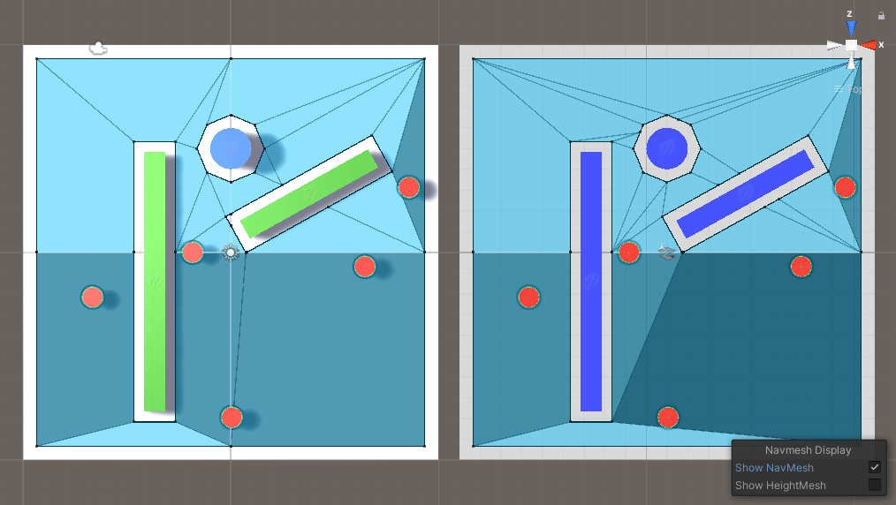
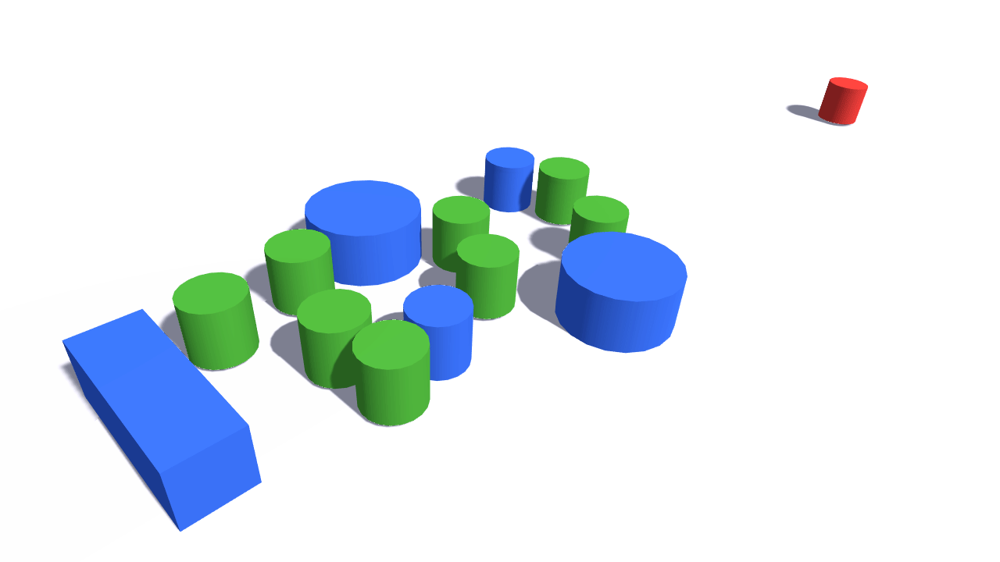

# Custom Nav Mesh

Alternative to Unity's NavMesh system where the **agents avoid the other non-moving agents** in their pathing. It uses the official navigation system, but you have to use its components instead. Compatible with **NavMeshComponents**. 

**Disclaimer:** This tool has not been thoroughly tested.

## How it works

**How do the agents avoid others**? Unity's **NavMeshAgent** only goes around **NavMeshObstacles** and ignores the other agents in their path. By disabling **NavMeshAgent** and enabling **NavMeshObstacle** when an agent is not moving noticeably, the agents now avoid other non-moving agents in their pathing.

Unity's NavMeshAgent             |  CustomNavMeshAgent
:-------------------------:|:-------------------------:
  |  

> **1. Set the destination** to the blue target.

**What if a moving agent collides against a stopped agent that's currently in obstacle mode**? By default, it wouldn't be able to push it. However, by:

- duplicating the baked surface, obstacle, and agents;
- making the duplicated agents switch between **NavMeshAgent** and **NavMeshObstacle** instead of the original ones;
- having each original agent copy the duplicated one's velocity, and the duplicated one copy the original's position at every frame.

> **2.** The duplicated **NavMesh** components. The **hidden** components are on the **right** side.

**You can** have agents **push** the **other agents**. This is how the **CustomNavMesh** system works under the hood. For it to work, you must use its **custom components**, which are **identical to the original ones**, making the transition **seamless**.

NavMeshAgent vs NavMeshObstacle "Agents"            |  CustomNavMeshAgents
:-------------------------:|:-------------------------:
  |  

> **3. Overlapping** agents by throwing one against the others. The **agents** are red and the **obstacles** blue. This is **just a showcase**. If you're trying to do something similar, you should use **colliders** and **physics** instead since this system is only supposed to **resolve agent overlap**.

**Why not** just **switch** the agents back to **NavMeshAgent** instead? That wouldn't work because switching from **NavMeshObstacle** to **NavMeshAgent** isn't instant — it would take at least two frames.

**What are the disadvantages?** Every **NavMesh** component is duplicated, which makes it less performant. However, It shouldn't be noticeable unless you have a lot of agents.

## Custom classes

**CustomNavMesh** – you can choose the hidden game objects **relative position** and whether or not they are **rendered** by accessing the class or through its **singleton** present in the **scene**.

> **4.** Changing **CustomNavMesh** fields.

- **CustomNavMeshSurface** – add to each surface that is going to be baked. These **surfaces** need to be **rendered meshes**. Both **Physics Colliders** and **Terrains** are ignored by it;
- **CustomNavMeshObstacle** – replacement for **NavMeshObstacle**;
- **CustomNavMeshAgent** – replacement for **NavMeshAgent**. It has some added properties:
  - **Time to Block** – time in **seconds needed** for the agent to **start blocking** (to make others go around it), assuming it hasn't surpassed the Unblock Speed Threshold during the interval;
  - **Unblock Speed Threshold** – the **speed at** which the agent **stops blocking** and moves instead;
  - **Block Refresh Interval** – time in **seconds needed** for the agent to **check** if it should **stop blocking**;
  - **Min Distance Boost to Stop Block** - When block is **refreshed**, this is the **minimum distance** the newly calculated reachable position must be **closer** from the target — **compared to its current distance** from the target — for it to **stop blocking**;
  - **The rest** have to do with the blocking obstacle carving and are identical to the **NavMeshObstacle carving settings**.

## How To Get Started

**Clone or download** this repository and open the project in Unity. Alternatively, you can **copy the contents** of `Assets/CustomNavMesh` to an **existing project**.

The **scenes** used for the **GIFs** are available in the `Assets/Examples` folder. Just hit the **Space Bar** in play mode to test it.

Note: This project was created using **Unity 2019.4 LTS** version. Tested in **PC Standalone**, **Android**, and **WebGL**.

## Contributing

**Pull requests** are welcome. For **major changes**, please open an issue first to discuss what you would like to change.

Things that I might implement later:
- Every time an agent in block mode does a refresh (tries to see if it should unblock), **SamplePosition** and **CalculatePath** are called. Both of these functions are **synchronous** and run on the **main thread**. I could implement the new experimental **NavMeshQuery operations** (not yet fully complete) which can be can be executed inside **jobs**.
- Import more methods and properties from the **NavMesh** and **NavMeshAgent** to the **CustomNavMesh** and the **CustomNavMeshAgent**, respectively.
- Create custom versions for the **NavMeshComponents'** components.

If you **need help** implementing this to your project or have any **questions**, just [message me](https://forum.unity.com/members/jadvrodrigues.4503760/) and I'll try to help. I'm also interested in any **tips** or **suggestions** you may have, cheers!

